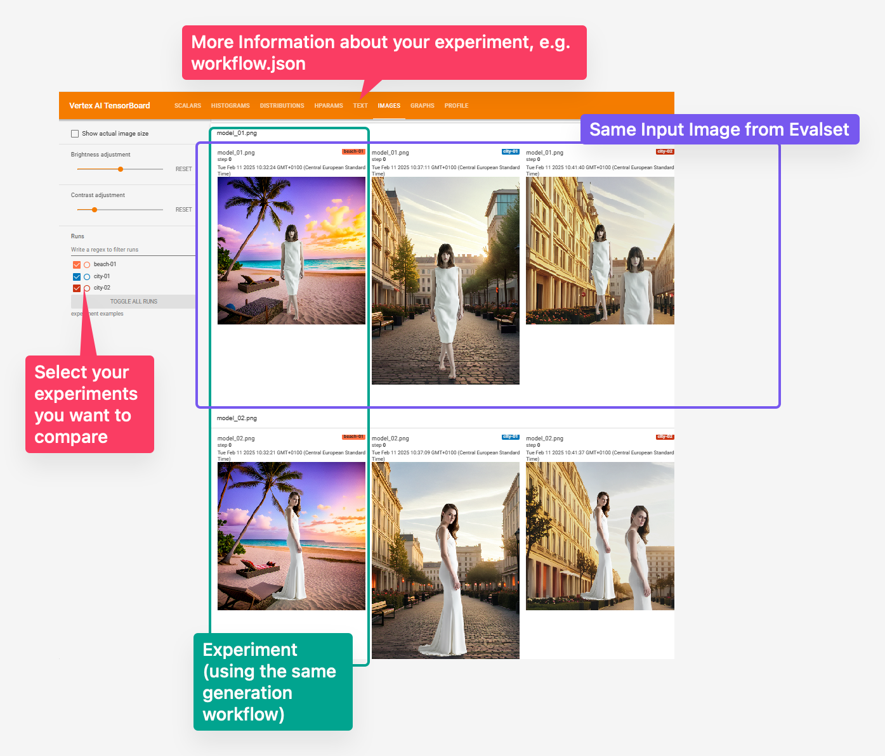
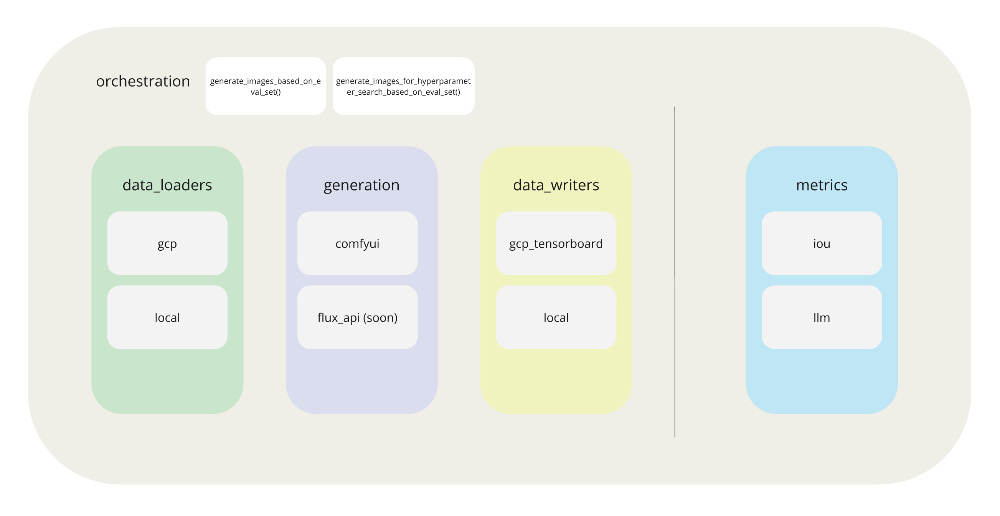

### Pixaris: An Evaluation Framework for Image Generation
Welcome to Pixaris, designed for data scientists/ ai engineers / creatives experimenting with image generation! Whether you're leveraging APIs or using ComfyUI, Pixaris streamlines your experiment tracking, making it faster and more efficient.

Inspired by the MLOps mindset, we aim to cultivate an ImageOps approach. With Pixaris, you can track, compare and evaluate your experiments.



## Key Features:
- Experiment Tracking with TensorBoard: Compare your experiments side by side
- Run Experiments Against Your Eval Set: Test your ComfyUI workflows against evaluation data set.
- "Hyperparameter" Search: Explore a limitless range of parameters, such as prompt, model, cfg, noise, seed—to discover the optimal settings for your image generation tasks.
- Implement Metrics for Evaluation: Assess your generated images using your own metrics, calling a multimodal llm.
- Trigger ComfyUI Workflows locally or remotly


## Installation 
To install Pixaris, follow these steps:

0. Make sure to have python 3.12 and poetry 2.0.1 or higher installed.
1. Clone the repository:
    ```sh
    git clone https://github.com/OG-DW/tiga_pixaris
    ```
2. Navigate to the project directory:
    ```sh
    cd pixaris
    ```
3. Install the required dependencies:
    ```sh
    poetry install
    ```
4. Optional:  If you prefer working with Notebooks, install [jupytext](https://github.com/mwouts/jupytext) and you can convert our py files to ipynb.
    ```sh
    pip install jupytext
    ```

    Most common jupytext cli commands:
    ```sh
    # convert notebook.ipynb to a .py file
    jupytext --to py notebook.ipynb  

    # convert notebook.py to an .ipynb file with no outputs               
    jupytext --to notebook notebook.py              


    ```

# Overview

## Getting Started

Follow these steps to set up and run your experiment:

1. **[Set Up Your Eval Set](#Set-Up-Your-Eval-Set)**: 
   Begin by defining your `DatasetLoader`. This component contains all the images required for your ComfyUI workflow, including masks, Canny images, and inspirational images.

2. **[Set Up Image Generation](#Set-Up-Image-Generation)**: 
   Next, define the functionality for generating images using the `Generator`. For example, the `ComfyGenerator` allows you to trigger ComfyUI workflows via API.

3. **[Set Up Experiment Tracking](#Set-Up-Experiment-Tracking)**: 
   Use the `DataWriter` to specify where your experiment data will be saved.

4. **[Define Arguments for Your Experiment Run](#Define-Arguments-for-Your-Experiment-Run)**: 
   Here, you will define `args` for your experiment run, such as the path to your comfyui-workflow.json and the `run_name`.

5. **[OPTIONAL: Set Up Evaluation Metrics](#Optional-Set-Up-Evaluation-Metrics)**: 
   If desired, you can add metrics to your experiment run, such as `llm_metric`, which allows an LLM to evaluate your images.

6. **[Orchestrate Your Experiment Run](#Orchestrate-Your-Experiment-Run)**: 
   Finally, orchestrate your experiment run using one of the generate function e.g., `generate_images_based_on_eval_set`.


### Summary

To utilize Pixaris for evaluating your experiments, you will always need a `DatasetLoader`, `ImageGenerator`, `DataWriter` and `args`. Once all components are defined, they will be passed to orchestration-function like `generate_images_based_on_eval_set`. This function is responsible for loading the data, executing the experiment, and saving the results.

For each component, we offer several options to choose from. For example, the `DatasetLoader` includes the `GCPDatasetLoader` for accessing data in Google Cloud Storage and a separate `LocalDatasetLoader` for accessing local evaluation data. Additionally, you have the flexibility to implement your own component tailored to your specific needs. Attached is an overview of the various components and their implementations.



For example usages, check the [examples](examples). Please note, to setup the gcp components, such as  `GCPDatasetLoader`, we use a config. Here is an [example_config.yaml](examples/example_config.yaml), if needed save a local version in the pixaris folder.

## Setting up your eval set
To run and evaluate an experiment, we need a common base of inputs that we iterate over in order to find out if our way of generating images is good and generalises well. Inputs of any format can be saved as an eval set. This could be images we use as inputs. Putting 10 images means that in one experiment, the workflow is run 10 times with the different images as an input accordingly.

Example: We want to generate backgrounds for photos of products with ComfyUI. We need an input and a mask image for the workflows we want to evaluate. In our ComfyUI workflow, the corresponding nodes are called "Load Input Image" and "Load Mask Image" (see [here](test/assets/test-background-generation.png)). In our eval_set, these are loaded from the folders "input" and "mask". Make sure that folder names in the eval set and the node titles in the workflow fit. The eval_set directory has the following structure:
```
eval_data
└───eval_set_name
    ├───input
    │   ├───image_01.jpg
    │   └───...
    └───mask
        ├───image_01.jpg
        └───...
```

When using the ComfyGenerator, the images from the "Input" folder will be loaded into the "Load Input Image" Node. Make sure that in each and every folder under eval_set_name (e.g. Input and Mask) are files with the same name. If in "Input" there is "image_01.jpg", there must be an "image_01.jpg" in "mask". For one workflow execution, one set of images with the same name is loaded into the workflow. At the end of the experiment, all images have been run through the workflow once.


First step: load your dataset using a `DatasetLoader`. If you have your eval_set saved locally, use the `LocalDatasetLoader`
```
from pixaris.data_loaders.local import LocalDatasetLoader
loader = LocalDatasetLoader(eval_set=<your eval_set name here>, eval_dir_local="eval_data")
```

If you have your data in a google cloud bucket, you can use the `GCPDatasetLoader`,
```
from pixaris.data_loaders.gcp import GCPDatasetLoader
loader = GCPDatasetLoader(
    gcp_project_id=<your cgp_project_id here>,
    gcp_bucket_name=<you gcp_bucket_name here>,
    eval_set=<your eval_dir here>,
    eval_dir_local="eval_data", # this is the local path where all your eval_sets are stored
)
```

### Setting up how you are generating images
We implemented a neat `ImageGenerator` that uses ComfyUI.
```
from pixaris.generation.comfyui import ComfyGenerator
comfy_generator = ComfyGenerator(workflow_apiformat_path=<WORKFLOW_PATH>)
```
the workflow_apiformat_path should lead to a JSON file exported from ComfyUI. You can export your workflow in apiformat as shown [here][test/assets/export_apiformat.png].

You can implement your own `ImageGenerator` for image generation with different tools, an API, or whatever you like. Your class needs to inherit from `ImageGenerator` and should call any image generation pipeline. A generator should parse a dataset into usable arguments for your generation. Override the function `generate_single_image` to call your generation.

### Setting up your experiment tracking
To save the generated images and possibly metrics, we define a `DataWriter`. In our case we want to have a nice visualization of all input and output images and metrics, so we choose the `GCPTensorboardWriter` using the google managed version.
```
from pixaris.data_writers.gcp_tensorboard import GCPTensorboardWriter
writer = GCPTensorboardWriter(
    project_id=<your gcp_project_id here>,
    location=<your gcp_location here>,
    bucket_name=<your gcp_bucket_name here>,
)
```
You can choose to save your results locally using the `LocalDataWriter` or implement your own class that inherits from the `DataWriter`. Usually, it would save images and possibly metrics from your experiment.

### Optional: Setup evaluation metrics
Maybe we want to generate some metrics to evaluate our results, e.g. for mask generation, calculate the IoU with the correct masks.
```
from pixaris.metrics.iou import IoUMetric
correct_masks_path = <path to your correct masks>
correct_masks = [Image.open(correct_masks_path + name) for name in os.listdir(correct_masks_path)]
iou_metric = IoUMetric(true_masks)
```

As always, it is intended for you to implement your own metrics by inheriting from the `BaseMetric` class.

### Define args for you experiment run
Depending on the specific components we defined and what they provide, we need to give some more arguments.
`args` can include whatever data is needed by any of the components, and is not given explicitly through parameters of a component. The content of `args` is highly dependent on the components you use.

For example, additional parameters you want to set in the workflow for the the `ComfyGenerator` can be specified by `generation_params`.
In `args` you can set a seed, an inspiration image for the workflow or which workflow image should be uploaded for documentation. In contrast to the inputs in the eval_set, these will be the same for each execution over the workflow within your experiment.

```
args = {
    "workflow_apiformat_path": WORKFLOW_PATH,
    "workflow_image_path": WORKFLOW_IMAGE_PATH,
    "eval_set": EVAL_SET,
    "generation_params": [
        {
            "node_name": "KSampler (Efficient)",
            "input": "seed",
            "value": 42,
        }
    ]
    "image_paths": [
        {
            "node_name": "Load Inspo Image",
            "image_path": "test/assets/test_inspo_image.jpg",
        }
    ],
    "run_name": "example_run",
}
```

### Orchestrate your experiment run
After defining all aforementioned components, we simply pass them to the orchestration
```
from pixaris.orchestration.base import generate_images_based_on_eval_set
out = generate_images_based_on_eval_set(
    data_loader=loader,
    image_generator=comfy_generator,
    data_writer=writer,
    metrics=[iou_metric],
    args=args,
)
```
Internally, it will load data, generate images, calculate metrics and save data using the previously defined objects.

## Naming Conventions
- **workflow execution**: Running a workflow for a single input, e.g., object image + mask image.
- **eval set**: Set of evaluation inputs, e.g., 10 * (object image + mask image).
- **run**: One eval set gets run with 1 workflow and 1 set of generation_params.
- **Hyperparameter Search**: One workflow, one eval set, multiple sets of generation_params, which results in multiple runs.
- **Experiment**: Synonymous to run, use run for clarity.
- **Generation Params**: Set of parameters to execute a single run.
- **Hyperparameters**: Multiple sets of different Generation Params, used in hyperparameter search.
- **args**: Includes inputs, e.g., can include workflow apiformat, input images, generation params, save directory, etc.


## License Information
TODO....Pixaris is open-source software licensed


## Contribute 
We published this project to inspire everyone to contribute their own ideas to this project. Feel free to fork and add new data loaders, generators, writers or metrics to pixaris! Learn here how: https://opensource.guide/how-to-contribute/
